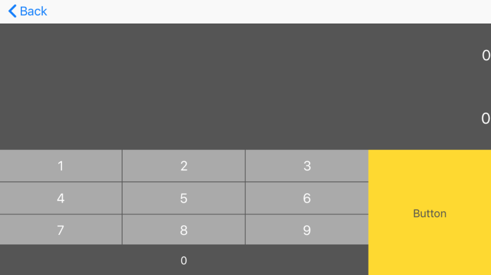
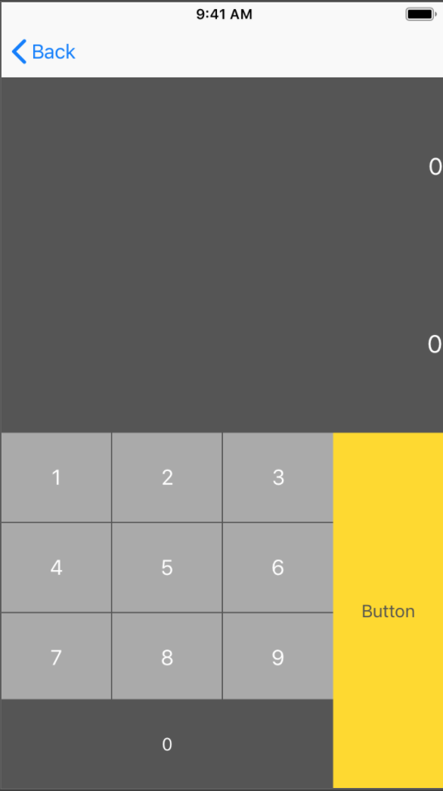

# Mashup Calator

## Version 1

### 간단한 계산기 만들어보기

- autoLayout 적용
- 테이블 뷰로 연산자 나타내기
- 다음 뷰에서 계산 값 나타내기
    - 연산자를 누를때 계산하기
- 추가로 
    - 간단한 스플래시 만들어보기

|가로|세로|
|--|--|
|||

> 시연 동영상 > [Youtube](https://youtu.be/Xi1xtgMvcxs)
 